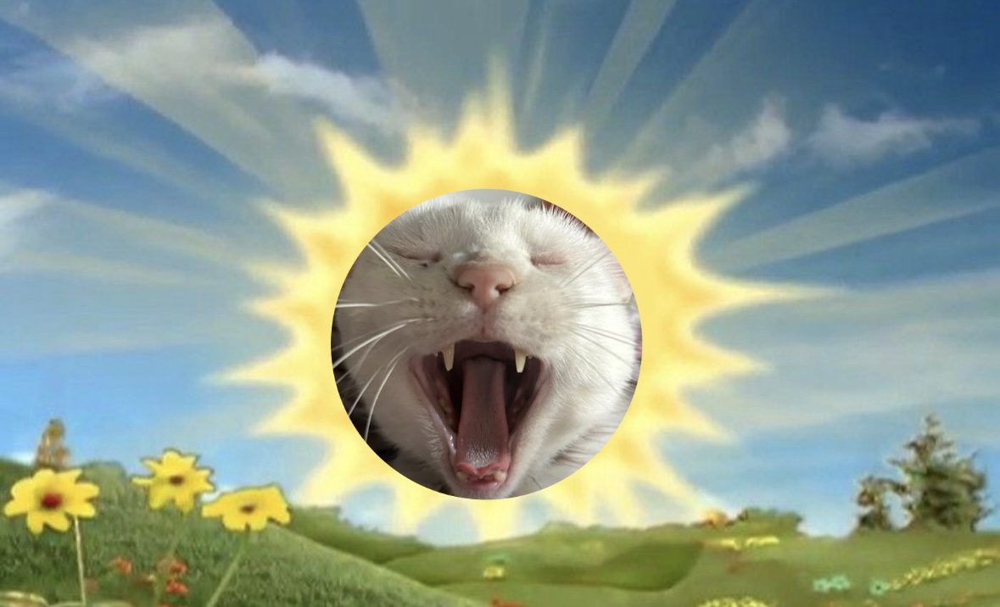
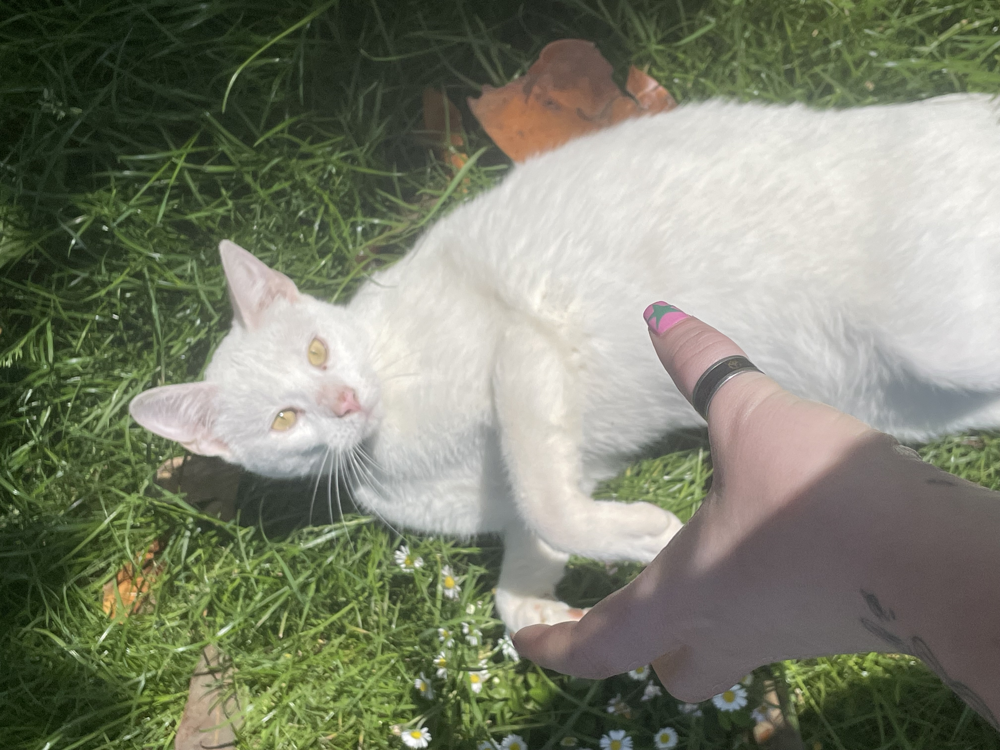

# Qui suis-je? 

 Enchantée, je m'appelle Stérenn Le Goff, 23 ans et je suis née dans la région finistérienne à Landerneau, une vraie bretonne d'origine et de naissance. J'étudie à l'UBO de Brest depuis 2021, en commençant par une première année de licence LEA anglais-chinois que j'ai vite abandonnée car un peu déçue, ensuite une première année de sociologie, qui pouvait me faire passer par une passerelle pour aller en psychologie, mais l'université l'a supprimée la même année, donc j'ai arrêté la sociologie pour faire ce qui me plaisait le plus : des langues. Je suis donc partie en LLCER anglais, où j'ai découvert la traduction, qui m'a directement attirée. Mais mon choix de master s'est confirmé en troisième année avec mon professeur référent, qui était aussi mon professeur de traduction. J'ai adoré apprendre à ses côtés et j'ai donc décidé de partir en master de traduction. Après avoir vécu la guerre sur MonMaster, j'ai fini par être acceptée à Brest. Finalement j'étais peut-être destinée à suivre toutes mes études à Brest ahah...   

 J'ai pu faire pas mal de choses dans ma vie et mon rêve était de voyager, en Asie encore plus, donc j'ai pu partir à deux reprises pour diverses raisons que je te laisse découvrir en deuxième partie. 

 J'adore les films, séries, la musique, les chats et surtout mon chat 

## Haru, mon fils.

 Il paraît tout blanc mais il est tout le temps dehors et sa passion c'est de se mettre sous les voitures, je pense que dans une autre vie il devait être mécanicien. Quand mon frère était encore chez mes parents, il était tout le temps dans sa chambre, parce que mon frère est mécanicien, donc il sent la mécanique. 

 Il lui manque sa queue parce que quand il était petit il voulait absolument sortir et on arrivait pas à l'empêcher comme il passait par tous les endroit possible et inimaginable pour aller dehors, donc un jour il s'est pris une voiture comme il avait pas encore tous les codes de l'extérieur, il à été hospitalisé 1 semaine et il à faillit mourir, maintenant il est bien en vie, il adore manger, il cours quand même partout, il a juste plus de queue. 

### Et un peu plus de moi et de ma vie sur cette page-là: ♥♠☻
[moi et moi](second_page)
#### encore plus sur celle-ci: ♥
[ mes centres d'intérêt](third_page)
