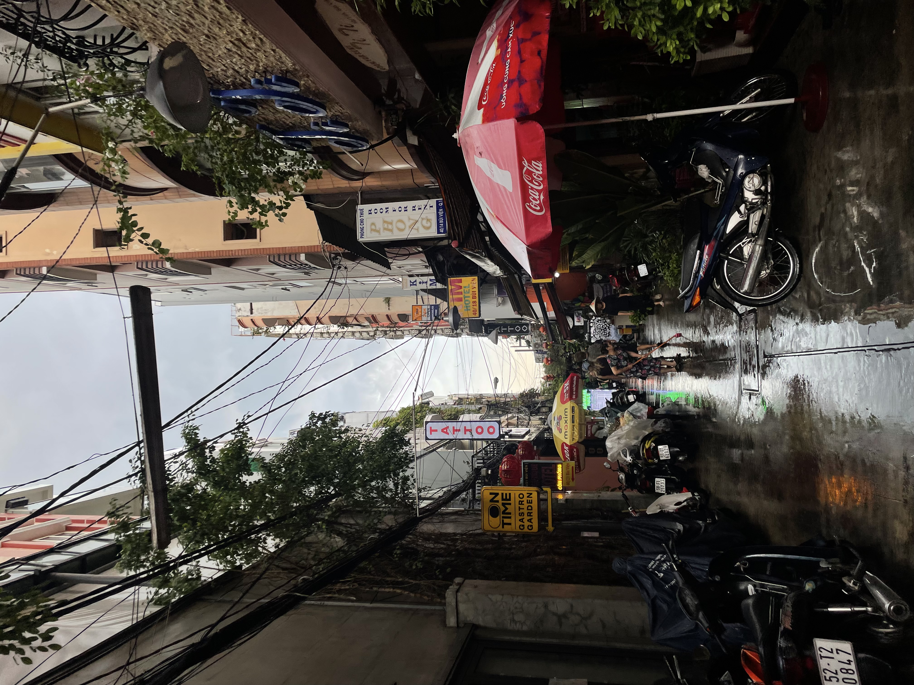
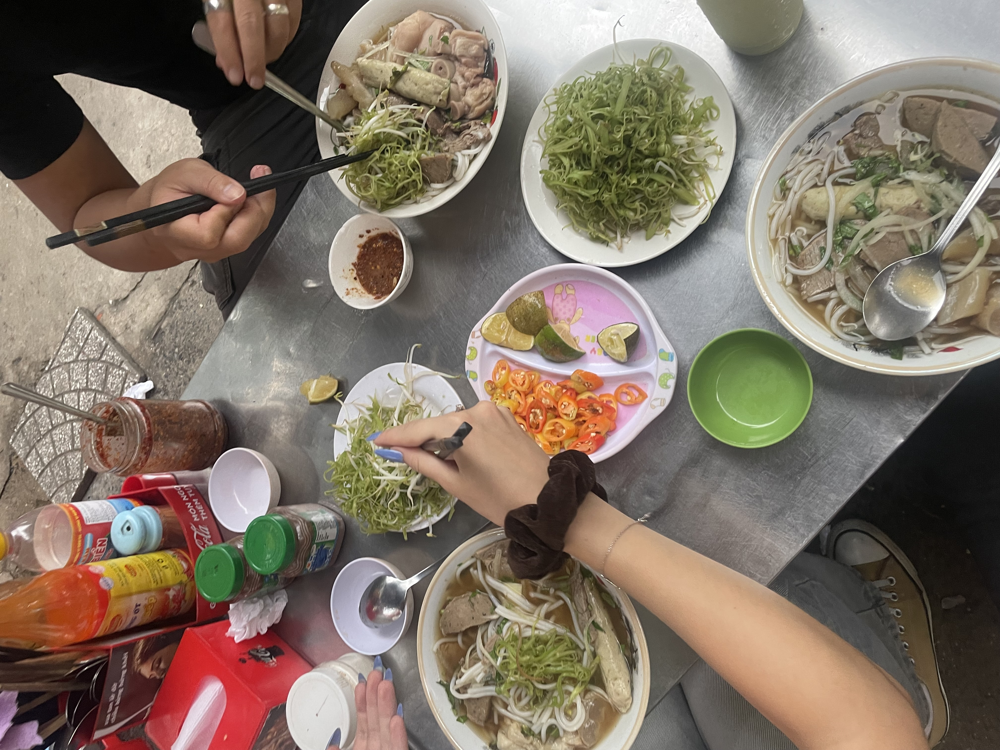
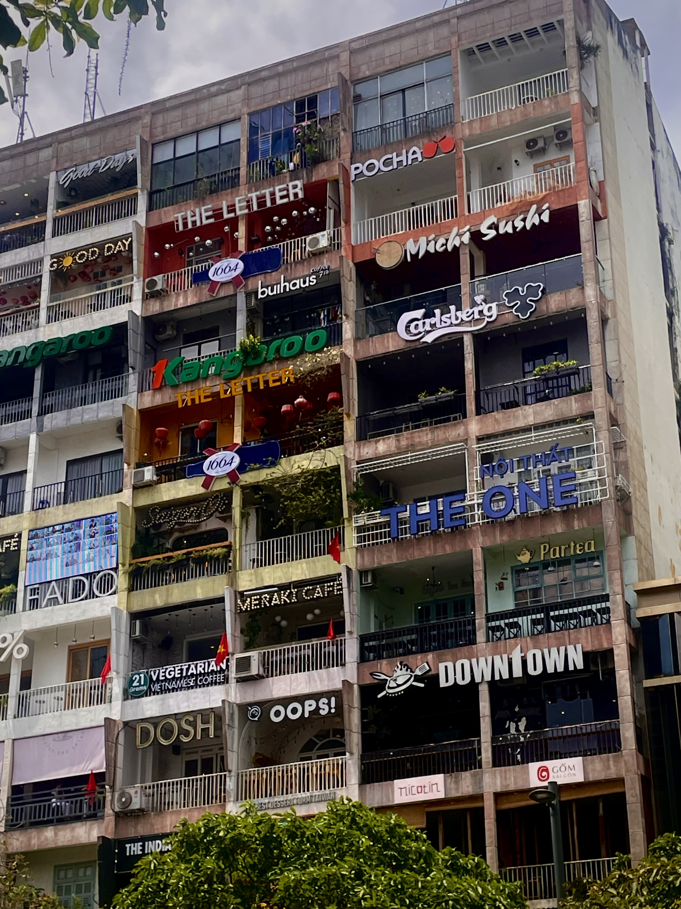
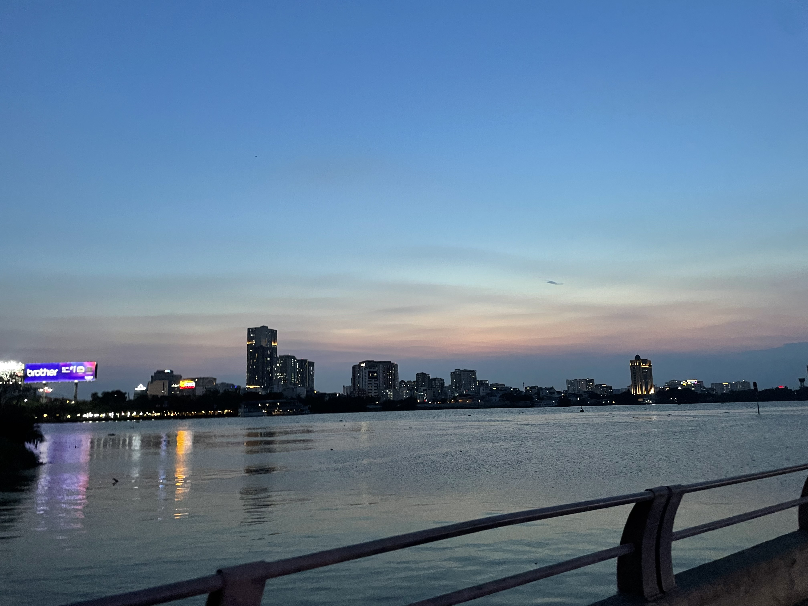
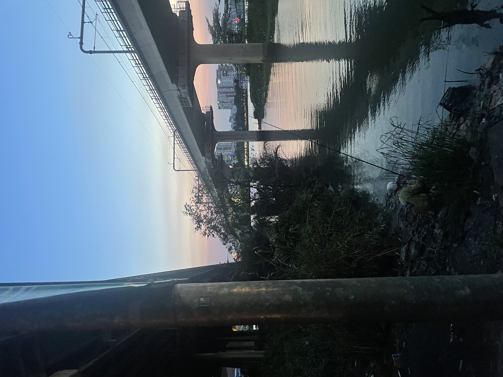
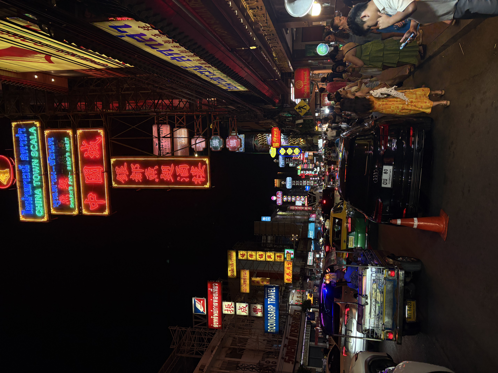
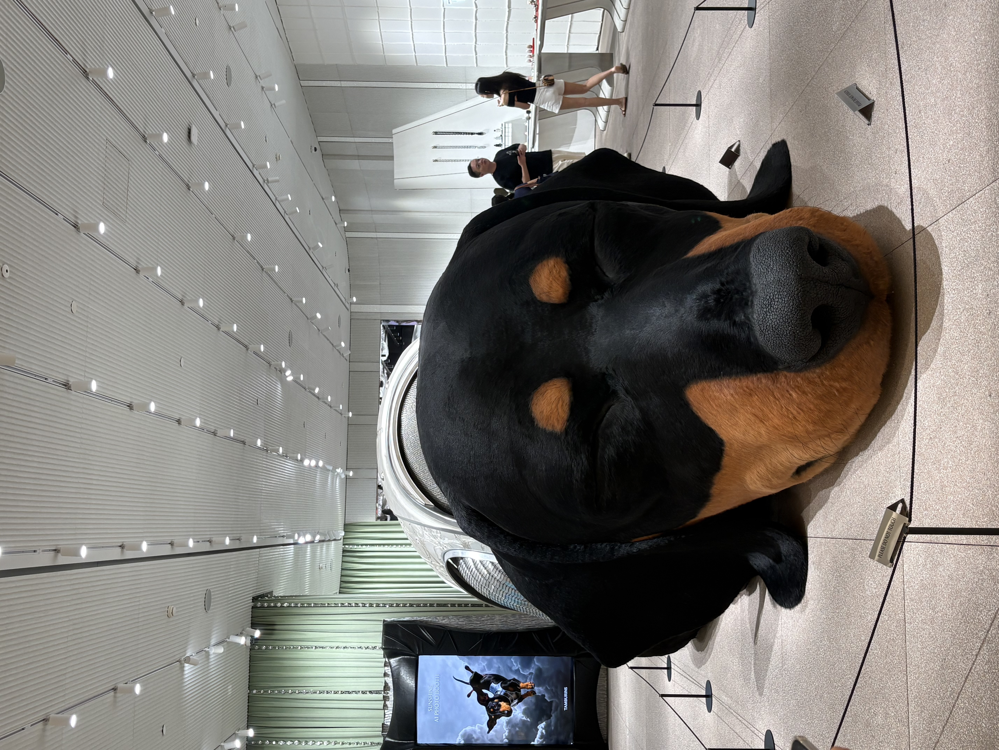
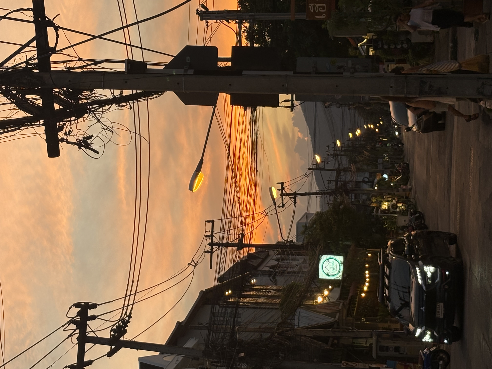
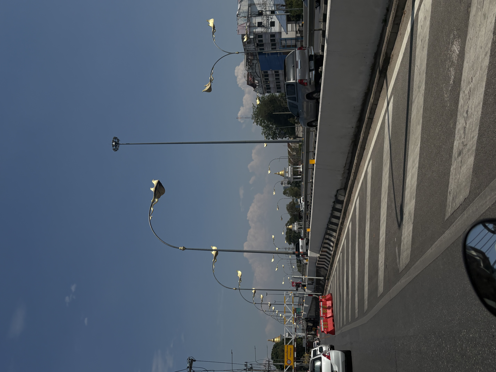
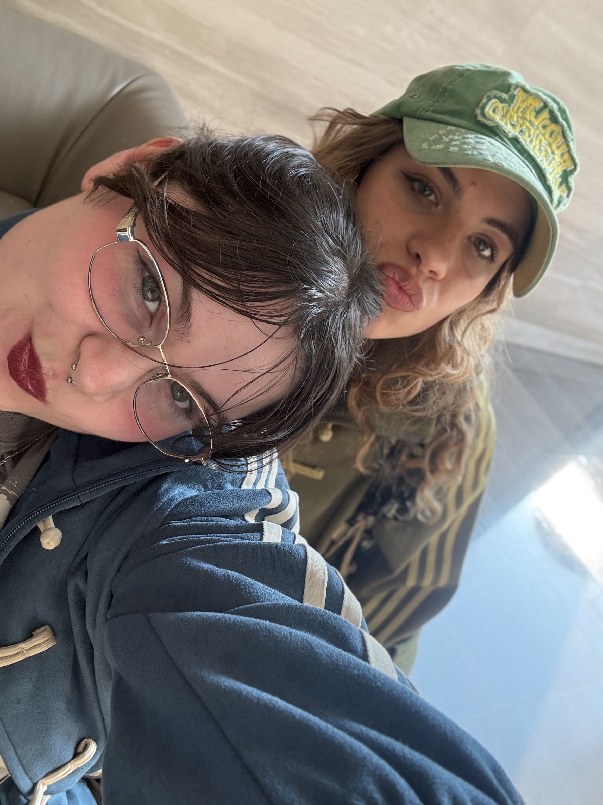

# Mes voyages en Asie! Ho-Chi-Minh City ou Saïgon!!

 Ma première fois au Vietnam.

 

 J'ai pu découvrir le Vietnam en 2024 car ma meilleure amie est partie habiter là-bas pendant deux ans à la suite de ses études. C'est la première fois que je suis vraiment sortie de la France, ou plutôt de l'europe. J'ai été très étonnée et émerveillée par le pays, mais plus que ça, ça m'a donné envie de découvrir l'Asie encore plus. J'avais déjà envie, et comme projet d'y partir, mais en Thaïlande plus spécifiquement. Mais l'opportunité d'aller voir ma meilleure amie là-bas était tentante et a été une très belle expérience. 

## Mes premiers repas 
 

 J'ai pu manger énormément de nourriture locale, aller dans des cafés et découvrir des musées et la culture vietnamienne qui a été énormément impactée par la guerre et par la colonisation française. 

### Les paysages étaient magnifiques même sans sortir de la ville.

 La nuit toutes les lumières illuminent Saïgon et c'est vraiment magnifique

 J'ai adoré me balader à la tombée de la nuit au bord de la rivière.

#### ET PUIS DEUX ANS PLUS TARD..
# La Thailande!!!!!!!

 Pour mon stage de 3ème année de licence je devais partir à l'étranger et j'ai choisi la Thaïlande, j'y ai eu quelques problèmes et je me suis finalement tournée vers du tourisme là-bas, j'y suis restée presque un mois au lieu de deux, et je suis restée à Bangkok et Chiang Mai dans le nord. Après ce voyage, je suis allée me "réfugier" deux semaines chez ma meilleure amie au Vietnam. 

## BANGKOK!!! Me voilà!!!

 Étonnamment ou non, un des premiers endroits où j'ai pu aller à Bangkok était le marché dans le quartier de Chinatown, très recommandé et magnifique comme on peut le voir. 

 J'ai aussi pu découvrir des endroits sympas et loufoques comme une exposition dans un centre commercial avec un animatronique de chien gigantesque dans un magasin de lunettes pour la marque Gentle Monster.Ce n'est pas le seul endroit un peu étonnant que j'ai pu visiter mais celui-ci ma particulièrement marquée comme le chien bougeait et respirait. 

### Chiang Mai me voilà!!

 Je n'ai pas beaucoup de photos de la Thaïlande comme j'ai pris énormément de vidéos ou alors je n'ai pris ni l'un ni l'autre. Je suis allée à Chiang Mai pour mon stage que j'ai finalement fini par fuir et j'ai donc visité un peu. C'était très joli et beaucoup plus montagneux, donc plus respirable et moins condensé en termes de bâtiments. Très très joli.

 C'était tellement reposant.

 J'ai même pu aller à une avant-première d'un film avec deux actrices que j'adore qui étaient présentes, c'était super comme experience même si j'avais vraiment du mal à tout comprendre ahaha.

# Et je suis partie fuir au Vietnam!

 Honnêtement je n'ai pas beaucoup de photos non plus comme je suis juste allée dans un endroit que je connaissais déjà donc je ne ressentais pas le besoin de vouloir tout immortaliser. C'était quand même une expérience incroyable que j'ai pu revivre avec ma meilleure amie et j'en suis ravie.

# Et voilà!! 

## Là, tu peux retrouver ma troisième page également, cette fois-ci sur mes centres d'intérêt!!!
[ mes centres d'intérêt](third_page)

