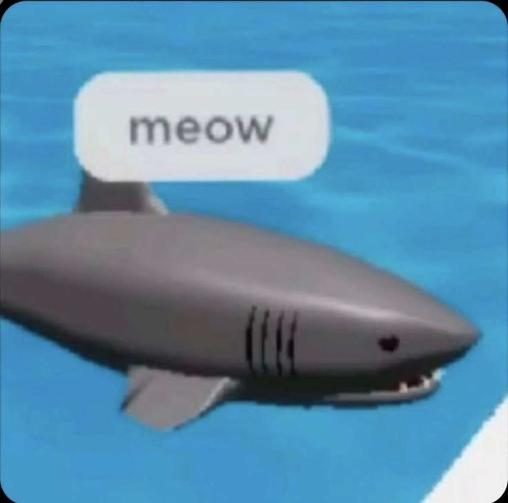
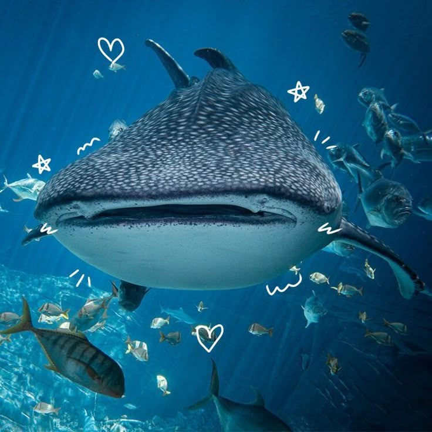
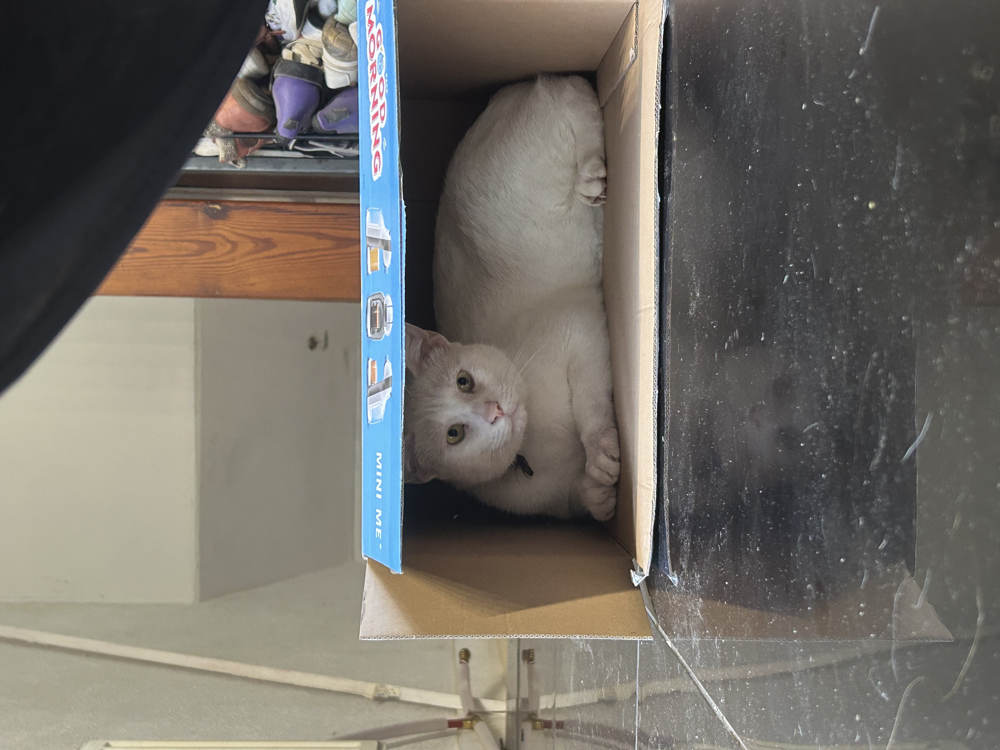
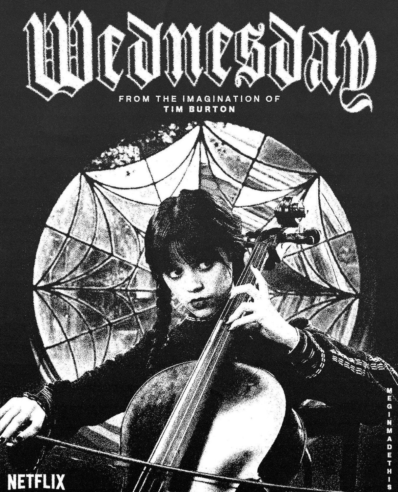
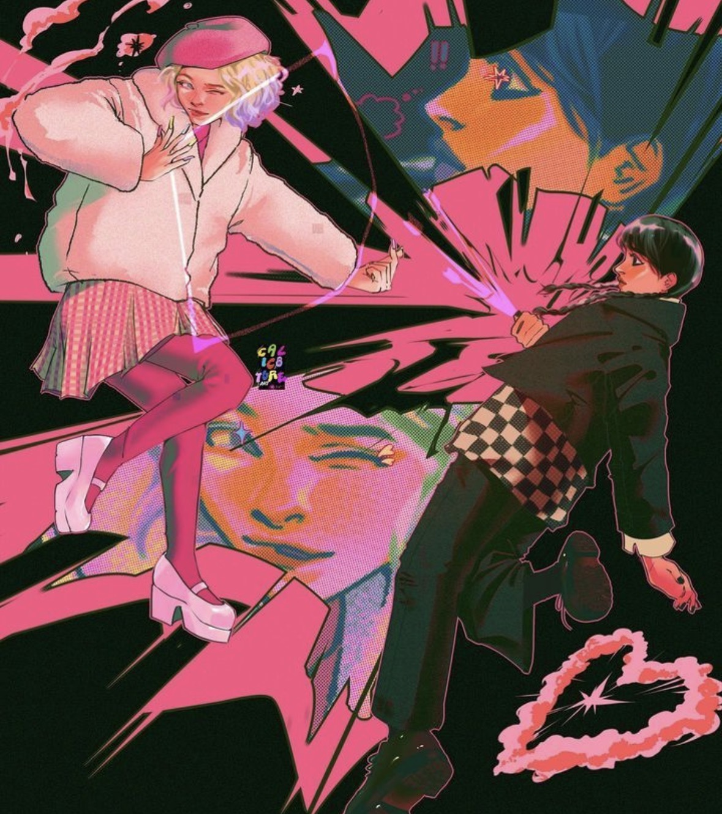
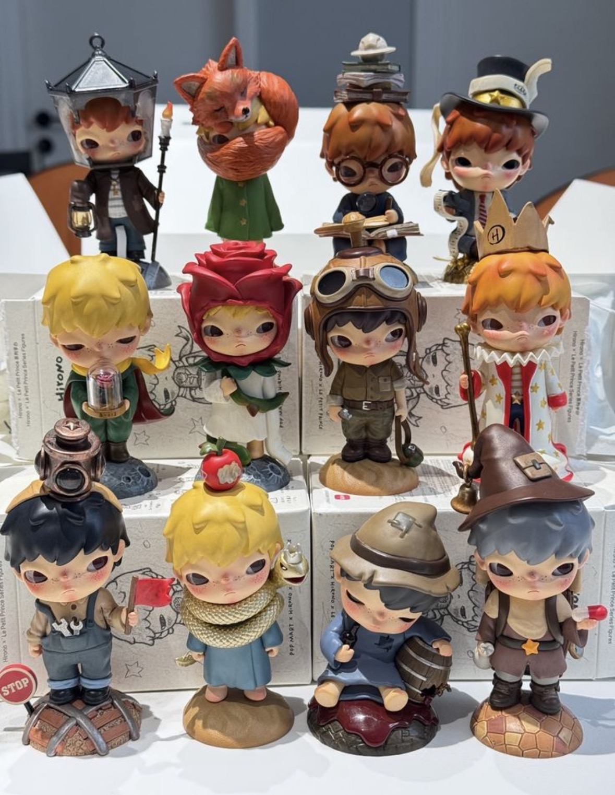
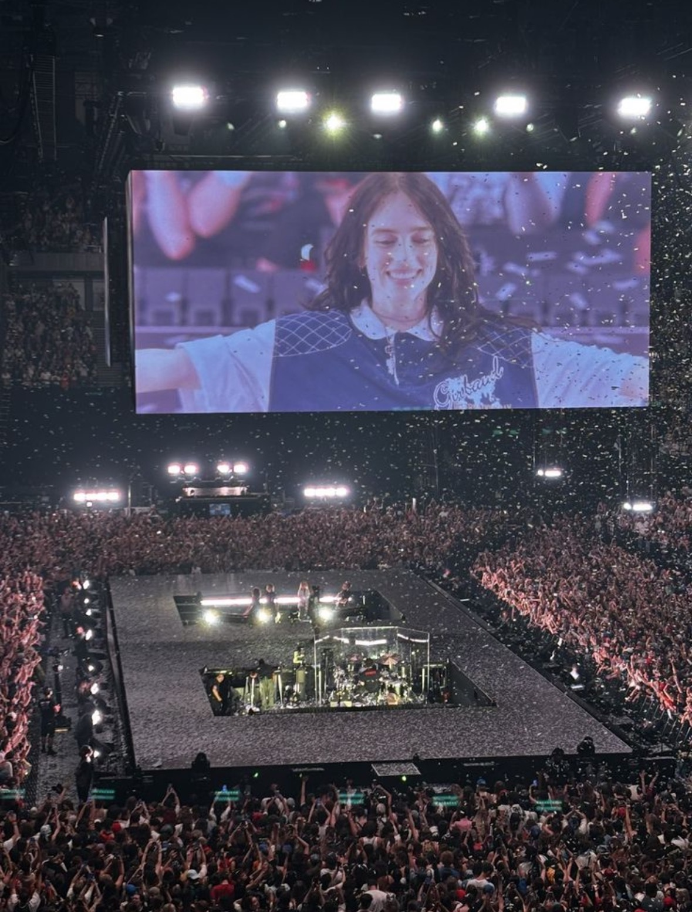

# mes centres d'intérêt
# Les requins

 Depuis petite, j'adore les requins et les chats pour 0 raisons particulières, ils sont juste super mignons et super drôles. Je ne suis malheureusement pas experte en la matière, mais j'ai 7 peluches de requins et un tatouage et j'adore. 

# les chats aussi du coup comme on peut le voir

 J'ai eu beaucoup de chats tout au long de ma vie et je ne pourrais pas vivre sans 

  
# Les films et séries

 Depuis quelques années je suis fan de la série Wednesday par Tim Burton.

 Je compte également faire mon mémoire sur cette série et plus particulièrement sur la relation des deux personnages principaux et comment celle-ci peut s'inscrire dans un registre queer. 

 Je suis également fan de cinéma de manière générale bien que j'aie un attrait plus intense pour le cinéma sapphique depuis de nombreuses années.Je dirais qu'actuellement je me concentre sur les Gl Thai, un genre de cinéma sapphique en développement. 

# Les figurines/poupées 

 J'ai toujours collectionné des poupées Monster High depuis que je suis petite. J'ai une petite collection car les prix sont chers et augmentent de plus en plus, mais j'en suis fan. Maintenant je collectionne également des petites figurines Hirono par Pop Mart, qui envahissent mon appartement, je l'avoue..mais jamais plus que mes peluches. 

 Ce n'est évidemment pas ma photo, j'en ai bien plus hihihi, ils sont cachés partout dans mon appartement!!

# La musique 

 Mes parents m'ont fait grandir dans une culture un peu rock, on va dire, même mes berceuses l'étaient, et j'ai donc évidemment succombé au phénomène. À mes 15 ans, j'ai découvert Billie Eilish et je la suis depuis. J'adore ses musiques depuis très longtemps et mes proches savent à quel point je suis fan! J'ai même réussi à faire Brest-Paris aller-retour entre deux partiels de rattrapage pour aller la voir… (j'ai attendu très longtemps aussi, faut m'excuser ahaha).

 Toujours pas ma photo, mais j'étais bien à ce concert, juste beaucoup plus loin et occupée à fangirler ahahaha!!

